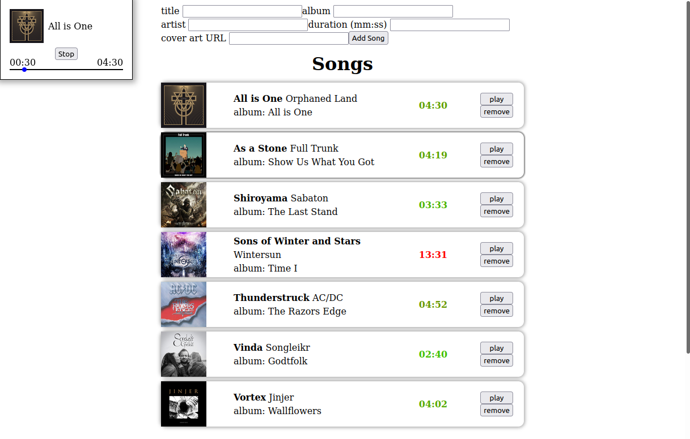
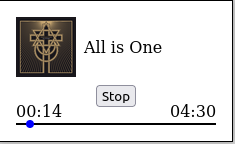
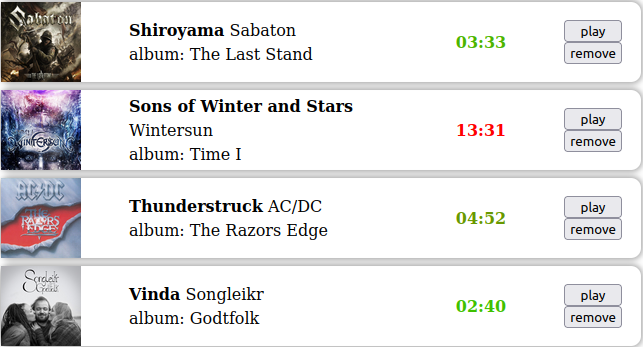

# MP3 DOM - [Third Weekend Assignment](./original_task.md)

A web app GUI based on the [last week project (Mp3PlayerTask)](https://github.com/noamgolani/Mp3PlayerTask). Using only Vanilla-JS, Events and DOM manipulations.

### [View Online](https://noamgolani.github.io/MP3-DOM/index.html) Version using Github-Pages.

### To run locally

      git clone https://github.com/noamgolani/MP3-DOM.git

      open "index.html" using your favorite browser

## About the project

The MP3-DOM project is build using js classes.

-  `index.js` - calls all the classes (custom elements) and implements "Top level" event-listeners.
-  `player.js` - holds all the initial player data: Songs and Playlists.
-  `helpers.js` - implements helper-functions used in other files.
-  **elements:**
   -  `playerElement.js` - a box displaying the current playing song.
   -  `songElement.js` - single song element displaying song properties.
   -  `songListElement.js` - a list displaying an array of songs and handles the song-related events.
   -  `playlistElement.js` - single playlist element displaying playlist properties.
   -  `playlistListElement.js` - a list displaying an array of playlists.

Bellow you will find descriptions for the "more interesting" files.

## [helpers.js](./helpers.js)

### Implements helper-functions used in other files.

-  ### createElement:
   Easily create a HTML Element
-  ### formatDuration:
   Change a sec based duration to `mm:ss` format
-  ### durationToSeconds:
   Change a `mm:ss` based duration to sec format
-  ### getSongById:
   Returns a song from the `player` object
-  ### generateId:
   Finds a unique ID for a given array
-  ### validator:
   An objects that maps a validation function for every input name. `validator['duration']("12")` will return `false` because it is not in `mm:ss` format.

## [playerElement.js](./playerElement.js)

### A box displaying the current playing song.

-  ### addToQueue:
   Adds songs/song to the queue of the player.
-  ### stop
-  ### play
-  ### playNext:
   Plays the next song in the queue
-  ### click:
   Handles all the `click` events inside the player element
-  ### set song:
   Sets the currents song - updates the display.
-  ### tick:
   Internal function for updation the time bar.

## [songListElement.js](./songListElement.js)

### A list displaying an array of songs and handles the song-related events.

-  ### sortList:
   Sorts the songList data + DOM Elements by title.
-  ### removeSong:
   Removes a song from the DOM and the data. Also dispaches a `songDeleted` event (the `playlistListElement` caches it).
-  ### addSong:
   Adds a song to the DOM and the data, also sorts the songs again.
-  ### playSong:
   Handles the clicks on the `Play` buttons, dispaches a custom `songChanged` event.

# Future

-  Make all the "Elements" inherit the `HTMLElement` js class, for smoother code. Then the state and dom element will be one!
-  Add more playlist related features:
   -  When clicking on a playlist change the displayed list to it.
   -  Allow full editing of playlists (add/remove song, create/delete playlist)
-  Save the player data (DB/LocalStorage)

**Thank you for reading this far**
Please open Issues with bugs or just ideas :)

# [Original Assignment](./original_task.md)
